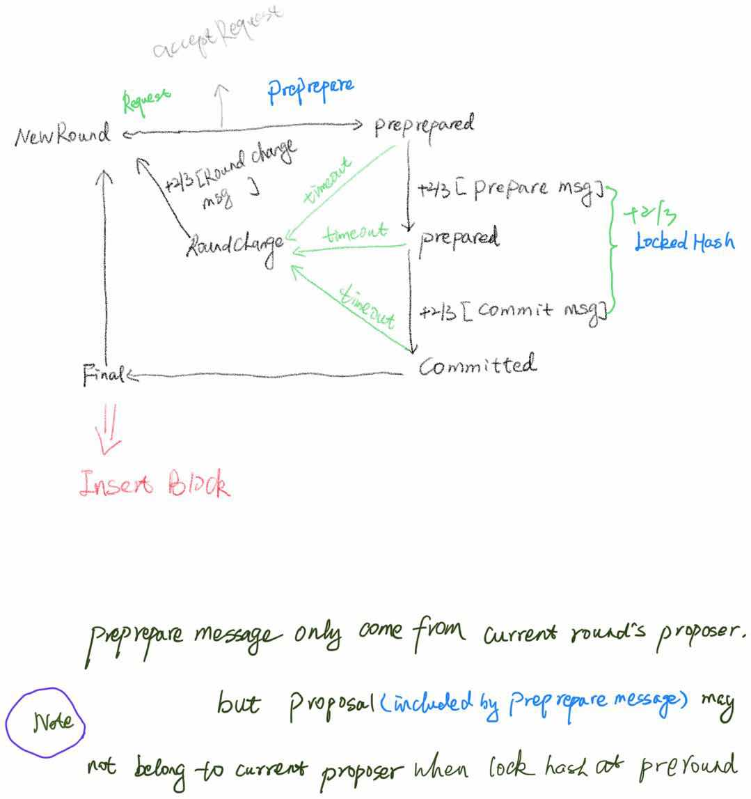

# 共识

- 为什么开发这个项目？

主要是个人比较喜欢这方面的东西，且以前在做分布式云存储的时候，也经常遇到这些算法的问题。不过存储用到的算法和`Paxos`这类还是有些区别的，业界用到
较多的还是亚马逊的`Dynamo`算法(`Quorum`，`Consistent Hash`)，`w + r > n` 这种模型; 又或者`MetaServer` + `Master + Slave`这种模型(`Fastdfs`，`Tfs`，元数据可以使用`Paxos`去实现集群来管理)，但不管那种都涉及到`CAP`的终极问题。

而`Paxos`这类了解程度还是停留在看小说的认识上，虽然在工作中也做了不少的东西，但也仅仅是应用以及白皮书阶段而已，`BFT`就更少了，要不是区块链的兴起，很难想象`拜占庭容错`算法适合的场景，长期躺尸的节奏。

- 为什么采用Rust语言

一直想使用一门底层的语言，`c/c++`长年不用，其他语言嘛，还不如`Go`来得酸爽。毫无疑问，对本来说，`Rust`是现阶段最好的选择-`安全/高性能`，当然难度也是很高的，至少`Rust`目前是本人感到最难入门的一门语言了。可以说，`Rust`是一门值得研究的语言，够研究几十年了。

## BFT

目前采用的是`PBFT`, 最基本的版本。麻雀虽小，五肺俱全，上个总图先：



每个节点使用`Validator`来标示。

### validator 状态
validator每一轮次（Height+Round）共有5种状态：
`AccpetRequest`, `PrePrepared`, `Prepared`, `Committed`，`round change`。

- AccpetRequest 

启动新轮次，进入等待提案阶段

- PrePrepared

收到预准备的消息（包含提案），即预准备阶段

- Prepared 

收到`+2/3`准备的消息，进入准备阶段

- Committed

收到`+2/3`提交的消息，进入准备阶段

- round change

这是一种特殊的状态，即在规定的时间内，本轮次无法达成，节点超时后，进入`Round change`状态，进行投票，切换视图。

### 锁机制

要做到拜占庭容错，除了防止`坏人`外，还得防止`好人`出错。比如下面的场景：
`A, B, C, D, E` 都到了最后一个阶段，都收到了`3`票`commit`，然后`E`投出一票`commit`，由于网络的原因，`A，B，C，D` 没有收到来之`E`的`commit`消息，`E` 自己`commit`了，而其他节点在本轮次中未达成共识，进而切换视图，继续共识。那么这时候，其他节点该提哪个`提案`？最好是继续上一轮的`提案`，因为`E`在上一轮已经`commit`了，这是时候，如果不提相同的提案，就会出现同一高度（同一序列号）出现了两个合法的提案（区块），在区块链里，就出现了分叉，因为这两个提案都是合法的。而`锁机制`就是为了解决这种情况，那么具体是怎么解决这种问题？

`Validator` 在接收到`+2/3`的`prepare + commit`时，会锁定在对应的提案，往后的投票validator只会投锁定的提案，不会对其他提案进行投票；如果没有锁定，还是按照正常的流程去投票，如：preprepare时，将军会使用`自己`的准备提案。

这样，即使`E`出现上面的情况，其他节点`A, B, C, D`接下来也是使用`E`的`commit` 继续共识，因为他们都锁定在该提案上。这样想想好像挺不错的.

`But` 哦，`No`，这里又引生出新的问题。

#### 锁机制带来的问题

假设：

Round： 0， proposal hash `0x22702c...ed16ca` from A

|  A   | receive 4 prepare votes |
| :--: | :---------------------: |
|  B   | receive 3 prepare votes |
|  C   | receive 1 prepare votes |
|  D   | receive 3 prepare votes |
|  E   |       No receive        |

此时除了`A`，其他都是节点都没有收到`+2/3`的票，即`A`锁定在`0x22702c...ed16ca`的提案上。当前`Round`未达成共识，切换视图，继续。

Round：1，proposal hash `0xc6d378...a95c0e` from B

|  A   |           No            |
| :--: | :---------------------: |
|  B   | receive 4 prepare votes |
|  C   | receive 1 prepare votes |
|  D   | receive 3 prepare votes |
|  E   |       No receive        |

A因为锁定在不同的提案上，所以当前轮，不再投票（只投 `round change`），`B`收到了`4`票，锁定在`0xc6d378...a95c0e`。试想一下，现在网络就好像出现了网络分区的情况，各个区`state`都不同，很难再达成共识。Why？

- `round 2`: 将军是`C`，无锁，所以提自己的提案：`0x74b9ba...dfb229`

- `round 3`: 将军是`D`，无锁，所以提自己的提案：`0xd62cf2...0b176e`

- `round 4`: 将军是`E`，无锁，所以提自己的提案：`0xc0fde9...2b3acc`

可以看出一个循环过去了，还是未达成共识。

`Round `5: 将军是`E`，有锁，所以提锁定的提案：`0x22702c...ed16ca`

可能会收到来之`C，D，E`加上自己的那一票，刚好`+2/3`票，即达成共识。

这算最好的结果了，试想一下，如果`C, D, E`中的某个节点`Down`机，那么共识将无法达。`A`和`B`只投自己锁定的提案，最多只会收到`2/3`的票，直到`Down`掉的节点再次恢复回来（即使恢复回来，也那么快成共识，因为其他节点的round已经比`Down`机节点的`round`高出好多）。

如何解决这些问题？

增加`lock hash pprof`，`A`，`B`在发起`PrePrepare`消息时，携带锁证明，证明前`round`大家是有投票给`lock proposal`的，不能够耍赖。其他节点收到证明后就验证（验证签名即可），如果验证通过则也锁定在该提案上。对未锁定的节点来说，可以这样做，但对于已经锁定的节点`B`，它该如果处理？

横向证明再加一个指标，除了签名证明外，还要采用优先级策略，即`A`锁定的`round`为`0`，`B`锁定的`round`为`1`，B是不会解锁`A`锁定的提案，`B`在本轮（`round 5`）不会投票给`A`。如果这一轮还未达到共识，`round 6`的时候，`B`广播的提案为`0xc6d378...a95c0e`，其他节点收到`PrePrepare`时，验证`B`的提案，发现`B`锁定提案的轮次（`round 1`）比他们锁定提案的轮次（来之于`A`的锁定高度`round 0`）高，所以他们就把锁重新锁定到`B`锁定的提案`0xc6d378...a95c0e`上，这样就达到了一致性，很快就可以达成共识。

### Round change 处理

`Round change`也可叫做`View Change`，简单来说就是视图切换，切换步骤如下（不同的项目采用的策略不一定相同）：

- 收到比当前小的轮次

投赞同票，让其能快速追上最新的步伐

```rust
if current_view.round > subject.view.round && subject.view.round > 0 {
            // may be peer is less than network node
            self.send_round_change(subject.view.round);
            return Ok(());
 }
```

- 收到更高的轮次

`+2/3`票，且处于`WaitForChange`状态，变更轮次

```rust
if n >= (current_val_set.two_thirds_majority() + 1)
            && (self.wait_round_change && current_view.round < subject.view.round) {
            self.send_round_change(subject.view.round);
            self.start_new_round(subject.view.round, &vec![]);
            return Ok(());
 } 
```

> PS: WaitForChange在收到+2/3的票时可以忽略其约束，即+2/3票即可catch up round

- 超时

获取票最多且最大的轮次，投票给它，而不是单循的`Round+1`投票。因为如果收到了某个较高轮次大量的投票，证明大多数人都已经到了相同的高度，各个节点都该往最终一致性的方向投票，加快共识的达成。

为了防止恶意节点的攻击，`大多数票`这是一个重要的指标（目前没有限制大多数至少是多少票，如果用于生产环境中，建议不要低于`1/3`的票数）。

```rust
		// Find the max
        let round = self.round_change_set.max_round();
        if round <= current_view.round {
            self.send_round_change(current_view.round + 1);
        } else {
            self.send_round_change(round);
        }
```

### Leader选举

`Leader = validator[hash(pre_hash + round) % validators.size]`

```
pub fn fn_selector(blh: &Hash, height: Height, round: u64, vals: &Validators) -> Validator {
    assert!(!vals.is_empty());
    let seed = (randon_seed(blh, height, vals) + round) % vals.len() as u64;
    vals[seed as usize].clone()
}

fn randon_seed(blh: &Hash, _height: Height, vals: &Validators) -> u64 {
    let blh = blh.as_ref();
    let mut seed_buf = [0; 16];
    for (idx, item) in seed_buf[..8].iter_mut().enumerate() {
        *item = blh[idx];
    }

    let block_seed: U128 = U128::from(seed_buf);
    (block_seed % U128::from(vals.len())).as_u64()
}
```


### 其他特殊以及改进的情况

- 提案带宽优化

采用`[Tendermint]`的方案，将区块切割成`小份+纠错码`的方式传播

- 增加`Lock Hash`
- 增加`Validator`管理合约，如剔除/新增某个合约等
- 增加当前区块包括上一个区块的`commit`信息，即当前区块应包含上一区块最后阶段投票的签名
- `Leader`选举更加随机化
- 增加更多的角色，让产生块以及共识的每个阶段又不同的角色去执行，提高公平性以及安全系数

资料来源：

[Tendermint]: https://github.com/tendermint/tendermint	"Tendermint"
[Ont]: https://github.com/ontio/ontology	"Tendermint"
[Istanbul Byzantine Fault Tolerance]: https://github.com/ethereum/EIPs/issues/650	"Tendermint"